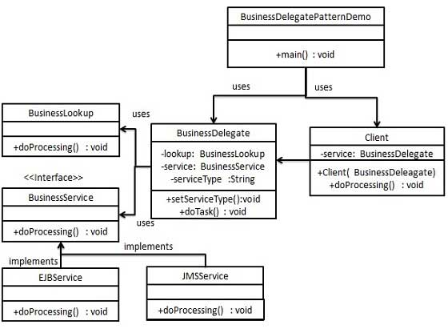

# 业务代表模式(Business Delegate Pattern) #

业务代表模式（Business Delegate Pattern）用于对表示层和业务层解耦

业务代表模式用来减少通信或对表示层代码中的业务层代码的远程查询功能

在业务层中我们有以下实体:

 *  **客户端（Client）** \- 表示层代码可以是 JSP、servlet 或 UI java 代码
 *  **业务代表（Business Delegate）** \- 一个为客户端实体提供的入口类，它提供了对业务服务方法的访问
 *  **查询服务（LookUp Service）** \- 查找服务对象负责获取相关的业务实现，并提供业务对象对业务代表对象的访问
 *  **业务服务（Business Service）** \- 业务服务接口。实现了该业务服务的实体类，提供了实际的业务实现逻辑

<!-- more -->

## 实现 ##



1.  创建 *Client* 、 *BusinessDelegate* 、 *BusinessService* 、 *LookUpService* 、 *JMSService* 和 *EJBService* 来表示业务代表模式中的各种实体
2.  定义类 *BusinessDelegatePatternDemo* 使用 *BusinessDelegate* 和 *Client* 来演示业务代表模式的用法

## 范例 ##

#### 1. 创建 BusinessService 接口 ####

*BusinessService.java*    

```java
public interface BusinessService {
   public void doProcessing();
}
```

#### 2. 创建实体服务类 ####

*EJBService.java*    

```java
public class EJBService implements BusinessService {

   @Override
   public void doProcessing() {
      System.out.println("Processing task by invoking EJB Service");
   }
}
```

*JMSService.java*    

```java
public class JMSService implements BusinessService {

   @Override
   public void doProcessing() {
      System.out.println("Processing task by invoking JMS Service");
   }
}
```

#### 3. 创建业务查询服务 ####

*BusinessLookUp.java*    

```java
public class BusinessLookUp {
   public BusinessService getBusinessService(String serviceType){
      if(serviceType.equalsIgnoreCase("EJB")){
         return new EJBService();
      }else {
         return new JMSService();
      }
   }
}
```

#### 4. 创建业务代表 ####

*BusinessDelegate.java*    

```java
public class BusinessDelegate {
   private BusinessLookUp lookupService = new BusinessLookUp();
   private BusinessService businessService;
   private String serviceType;

   public void setServiceType(String serviceType){
      this.serviceType = serviceType;
   }

   public void doTask(){
      businessService = lookupService.getBusinessService(serviceType);
      businessService.doProcessing();       
   }
}
```

#### 5. 创建客户端 ####

*Client.java*    

```java
public class Client {

   BusinessDelegate businessService;

   public Client(BusinessDelegate businessService){
      this.businessService  = businessService;
   }

   public void doTask(){        
      businessService.doTask();
   }
}
```

#### 6. 使用 BusinessDelegate 和 Client 类来演示业务代表模式 ####

*BusinessDelegatePatternDemo.java*    

```java
public class BusinessDelegatePatternDemo {

   public static void main(String[] args) {

      BusinessDelegate businessDelegate = new BusinessDelegate();
      businessDelegate.setServiceType("EJB");

      Client client = new Client(businessDelegate);
      client.doTask();

      businessDelegate.setServiceType("JMS");
      client.doTask();
   }
}
```

编译运行以上 Java 范例，输出结果如下

```shell
$ javac -d . src/main/cn/twle/gof/BusinessDelegatePatternDemo.java
$ java  cn.twle.gof.BusinessDelegatePatternDemo
Processing task by invoking EJB Service
Processing task by invoking JMS Service
```
