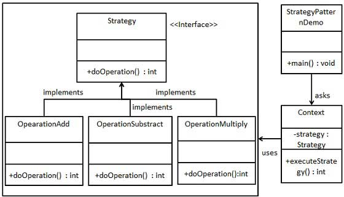

# 策略模式 ( Strategy Pattern ) #

策略模式（Strategy Pattern）中一个类的行为或其算法可以在运行时更改

策略模式创建表示各种策略的对象和一个行为随着策略对象改变而改变的 context 对象，策略对象改变 context 对象的执行算法。

策略模式属于行为型模式

<!-- more -->

## 摘要 ##

1.  **意图：**
    
    定义一系列的算法,把它们一个个封装起来, 并且使它们可相互替换
2.  **主要解决：**
    
    在有多种算法相似的情况下，使用 if...else 所带来的复杂和难以维护
3.  **何时使用：**
    
    一个系统有许多许多类，而区分它们的只是他们直接的行为
4.  **如何解决：**
    
    将这些算法封装成一个一个的类，任意地替换
5.  **关键代码：**
    
    实现同一个接口
6.  **应用实例：**
    
    1.  诸葛亮的锦囊妙计，每一个锦囊就是一个策略
    2.  旅行的出游方式，选择骑自行车、坐汽车，每一种旅行方式都是一个策略
    3.  JAVA AWT 中的 LayoutManager
7.  **优点：**
    
    1.  算法可以自由切换
    2.  避免使用多重条件判断
    3.  扩展性良好
8.  **缺点：**
    
    1.  策略类会增多
    2.  所有策略类都需要对外暴露
9.  **使用场景：**
    
    1.  如果在一个系统里面有许多类，它们之间的区别仅在于它们的行为，那么使用策略模式可以动态地让一个对象在许多行为中选择一种行为
    2.  一个系统需要动态地在几种算法中选择一种
    3.  如果一个对象有很多的行为，如果不用恰当的模式，这些行为就只好使用多重的条件选择语句来实现
10. **注意事项：**
    
    如果一个系统的策略多于四个，就需要考虑使用混合模式，解决策略类膨胀的问题

## 实现 ##



1.  创建一个定义活动的 *Strategy* 接口和实现了 *Strategy* 接口的实体策略类，*Context* 是一个使用了某种策略的类
2.  定义 *StrategyPatternDemo* 类使用 *Context* 和策略对象来演示 Context 在它所配置或使用的策略改变时的行为变化

## 范例 ##

#### 1. 创建一个接口 ####

*Strategy.java*    

```java
public interface Strategy {
   public int doOperation(int num1, int num2);
}
```

#### 2. 创建实现接口的实体类 ####

*OperationAdd.java*    

```java
public class OperationAdd implements Strategy{
   @Override
   public int doOperation(int num1, int num2) {
      return num1 + num2;
   }
}
```

*OperationSubstract.java*    

```java
public class OperationSubstract implements Strategy{
   @Override
   public int doOperation(int num1, int num2) {
      return num1 - num2;
   }
}
```

*OperationMultiply.java*    

```java
public class OperationMultiply implements Strategy{
   @Override
   public int doOperation(int num1, int num2) {
      return num1 * num2;
   }
}
```

#### 3. 创建 *Context* 类 ####

*Context.java*

```java
public class Context {
   private Strategy strategy;

   public Context(Strategy strategy){
      this.strategy = strategy;
   }

   public int executeStrategy(int num1, int num2){
      return strategy.doOperation(num1, num2);
   }
}
```

#### 4. 使用 *Context* 来查看当它改变策略 *Strategy* 时的行为变化 ####

*StrategyPatternDemo.java*

```java
public class StrategyPatternDemo {
   public static void main(String[] args) {
      Context context = new Context(new OperationAdd());        
      System.out.println("10 + 5 = " + context.executeStrategy(10, 5));

      context = new Context(new OperationSubstract());      
      System.out.println("10 - 5 = " + context.executeStrategy(10, 5));

      context = new Context(new OperationMultiply());       
      System.out.println("10 * 5 = " + context.executeStrategy(10, 5));
   }
}
```

编译运行以上 Java 范例，输出结果如下

```shell
$ javac -d . src/main/cn/twle/gof/StrategyPatternDemo.java
$ java  cn.twle.gof.StrategyPatternDemo
10 + 5 = 15
10 - 5 = 5
10 * 5 = 50
```
